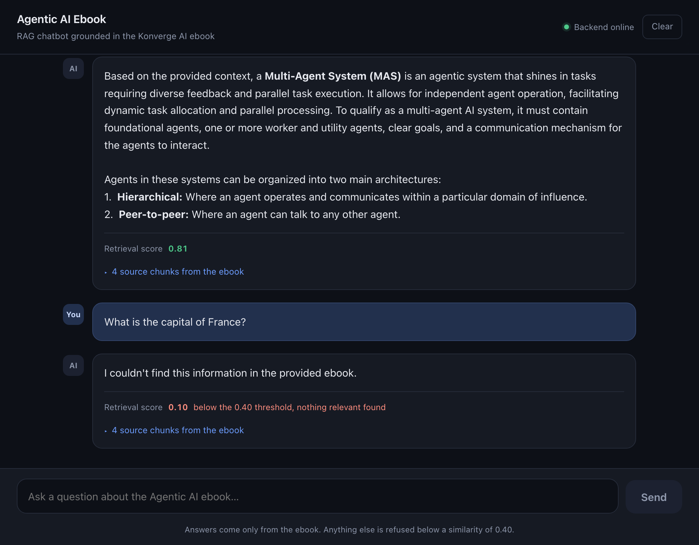
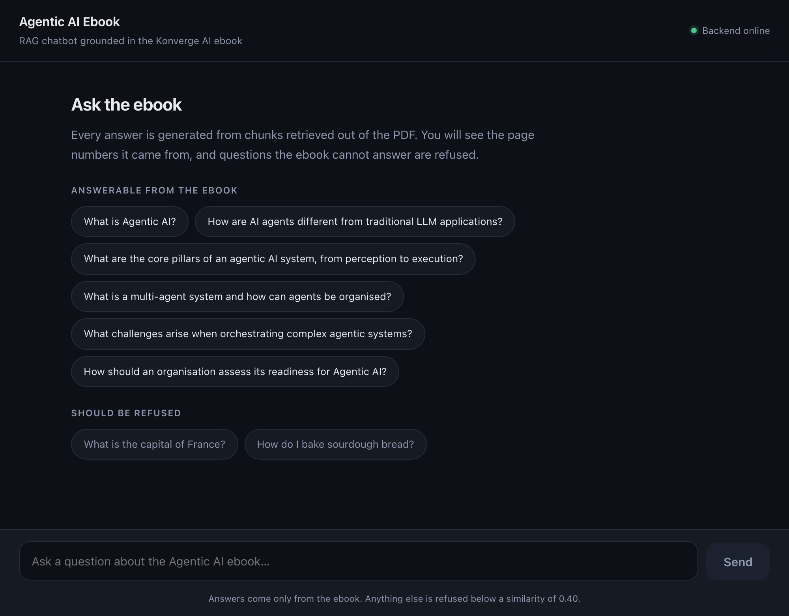

# Agentic AI Ebook — RAG Chatbot

A retrieval-augmented generation (RAG) chatbot that answers questions **only** from the
[Konverge AI *Agentic AI* ebook](https://konverge.ai/pdf/Ebook-Agentic-AI.pdf).
If the answer is not in the ebook, the chatbot says so.

It ships with a React chat interface and a JSON API. Built for the AI Engineering Intern take-home
assignment: **Python · LangGraph · Pinecone · FastAPI · React**, in roughly 250 lines of Python
and 400 lines of JSX.



*An answerable question (retrieval score 0.81) and a question the ebook cannot answer (0.10, refused).*

<p align="center">
  
</p>

The landing screen offers six questions that are answerable from the ebook and two that should be
refused, so the grounding behaviour can be checked in two clicks.

---

## 1. What this project is

The ebook is about *Agentic AI* — AI systems that can plan, use tools and act on their own.
A normal LLM chatbot cannot answer questions about a specific 60-page PDF unless the whole
document is pasted into the prompt, which is slow, expensive and imprecise.

This project splits the PDF into small pieces, **embeds** each piece, stores those embeddings
in **Pinecone**, and at question time fetches the few pieces closest to the user's question and
gives only those to the LLM. The answer is therefore grounded in the ebook, and every answer
comes back with the page numbers it was built from.

---

## 2. Architecture

### At question time

```
React UI (frontend/, port 5173 in dev)  ──or──  curl / any HTTP client
  │  POST /chat  {"question": "What is a multi-agent system?"}
  ▼
FastAPI  (app/main.py, port 8000)
  ▼
LangGraph  (app/rag.py)          START
  │
  ├──► retrieve ──► embed the question ──► Pinecone (cosine similarity, top-4)
  │                     │
  │                     └──► 4 ebook chunks + similarity scores
  ▼
  └──► generate ───► question + those 4 chunks ──► Qwen 3.8 27B (via Groq)
  │                     │
  │                     └──► grounded answer  END
  ▼
JSON: answer + confidence + sources (page, score, text)
  │
  ▼
UI renders the answer, the retrieval score, and a collapsible list of source chunks
```

In development Vite proxies `/chat` and `/health` to port 8000, so the browser only ever talks to
one origin and no CORS configuration is needed. In production FastAPI serves the built React app
itself, so the whole thing runs on a single port.

### At ingestion time (run once)

```
PDF URL ──► data/Ebook-Agentic-AI.pdf ──► PyMuPDF text extraction
                                          ▼
                             split into 113 chunks (~1000 chars, 150 overlap)
                                          ▼
                             MiniLM-L6-v2 embeddings (384-d, runs locally)
                                          ▼
                                   Pinecone index  (384-d, cosine)
```

---

## 3. Tech stack

| Piece | Choice | Why |
|---|---|---|
| Language | Python 3.10+ | Required. |
| API | **FastAPI** | ~60 lines, auto-generated `/docs`, easy to explain. |
| Chat UI | **React 19 + Vite** | The assignment allows a React UI. No UI framework — plain components, plain CSS, no Tailwind, no component library. |
| Orchestration | **LangGraph** | Required. Two nodes and three edges, so the workflow is fully visible. |
| Vector DB | **Pinecone** (serverless, AWS `us-east-1`, cosine) | Required. Managed, free tier is enough for 113 vectors. |
| Embeddings | **`sentence-transformers/all-MiniLM-L6-v2`** via `fastembed` (384-d, local) | Runs on CPU with no API key and no cost, and performs well on this corpus. |
| LLM | **`qwen/qwen3.8-27b`** via **Groq** | Free tier, OpenAI-compatible API, fast inference, strong instruction following. |
| PDF parsing | **PyMuPDF** | Fast, maintained, no external binaries. |
| Config | `python-dotenv` | `.env` file. |
| Tests | `pytest` + `httpx` | `TestClient`, no running server needed. |

### Why these two providers

**Groq for the LLM.** It exposes an OpenAI-compatible endpoint, so it is the *same*
`openai` Python SDK with a different `base_url` — no extra dependency and no custom HTTP code.
It is fast enough that the demo feels instant, and the free tier is enough for a reviewer to
run the whole project without paying anything. `openai/gpt-oss-120b` is also available on the
same account; set `GROQ_MODEL` in `.env` to switch. It is not the default because it is a
reasoning model that spends output tokens on internal reasoning before answering.

**Local embeddings via `fastembed`.** Groq does not serve an embeddings endpoint, and this
project should not require a paid second provider just to embed 113 chunks. `fastembed` runs
`all-MiniLM-L6-v2` through ONNX Runtime on the CPU: no API key, no cost, no network call, and
nothing is sent off the machine. It is only ~90 MB and embeds the whole book in a few seconds.
If you would rather use a hosted model, `app/embeddings.py` is the only file that changes — set
`EMBEDDING_DIMENSIONS` in `app/config.py` to match and re-run `python scripts/ingest.py
--rebuild` so the index is recreated at the new size.

**No LangChain.** LangGraph is required and does not need LangChain. Calling the OpenAI and
Pinecone SDKs directly keeps the retrieval step readable.

---

## 4. How RAG works

### Embeddings, in one paragraph

An **embedding** is a list of 384 numbers that represents the *meaning* of a piece of text.
A model is trained so that texts with similar meanings end up as vectors pointing in a similar
direction, and unrelated texts point in different directions. You can therefore compare two
pieces of text by measuring the angle between their vectors — no keyword matching needed.
This is why searching an embedding for *"cost of an agent"* can return a chunk that says
*"how much does an agent cost?"* even though the words barely overlap.

### Indexing (once, offline)

1. Download the PDF and extract the text of each page with PyMuPDF.
2. Slide a 1000-character window over each page, overlapping by 150 characters → 113 chunks.
3. Embed every chunk → 113 vectors of 384 numbers.
4. Upsert each vector into Pinecone with metadata: `text`, `page`, `chunk_id`.

### Answering (per question)

1. Embed the user's question → one vector.
2. Ask Pinecone for the 4 chunks whose vectors are most similar (cosine similarity).
3. Build a prompt: system instructions + those 4 chunks (each tagged with its page) + the question.
4. The LLM answers using only that prompt.
5. Return the answer, the chunks and the best similarity score.

The key idea: **the LLM never sees the whole book, only the few relevant paragraphs**, so it
can only ground its answer in those paragraphs, and the API can show you exactly which ones.

---

## 5. Setup

```bash
git clone https://github.com/<your-username>/agentic-ai-rag-chatbot.git
cd agentic-ai-rag-chatbot

python3 -m venv .venv
source .venv/bin/activate          # Windows: .venv\Scripts\activate

pip install -r requirements.txt

cp .env.example .env               # then edit .env
```

The committed `frontend/dist` means the UI works without Node. To *develop* the UI you also need:

```bash
cd frontend
npm install
```

Requires Python 3.10+ and Node 18+.

Fill in `.env`:

| Variable | Where to get it |
|---|---|
| `PINECONE_API_KEY` | [app.pinecone.io](https://app.pinecone.io) → **API Keys** → create key. The free plan is enough. |
| `PINECONE_INDEX_NAME` | Any name. The script creates the index if it is missing. Default `agentic-ai-ebook`. |
| `GROQ_API_KEY` | [console.groq.com/keys](https://console.groq.com/keys) → **Create API Key**. Free, no card required. |
| `GROQ_MODEL` | Optional. Defaults to `qwen/qwen3.8-27b`. |

No OpenAI key is needed — embeddings are local and generation goes to Groq.
`.env` is git-ignored; never commit real keys.

The first ingestion downloads the MiniLM model (~90 MB) once and caches it.

---

## 6. Ingest the PDF

```bash
python scripts/ingest.py
```

This script:

1. downloads the PDF into `data/` (skipped if the file is already there),
2. extracts text page by page with PyMuPDF,
3. splits it into ~1000-character chunks with 150-character overlap,
4. embeds every chunk locally with MiniLM-L6-v2,
5. creates the Pinecone index if needed and upserts all 113 chunks.

Expected output:

```
PDF already present: .../data/Ebook-Agentic-AI.pdf
Extracted 59 pages -> 113 chunks
  uploaded 96/113
  uploaded 113/113
Done. 113 chunks are in Pinecone.
```

Re-run at any time to rebuild:

```bash
python scripts/ingest.py --rebuild    # deletes the index first, then re-ingests
```

---

## 7. Run the app

Two terminals.

**Terminal 1 — the Python backend:**

```bash
uvicorn app.main:app --reload
```

**Terminal 2 — the React UI:**

```bash
cd frontend
npm install
npm run dev
```

Then open **<http://localhost:5173>**. The header badge shows **Backend online** once `/health`
responds. If the backend is not running the badge turns red, the composer disables itself and
tells you what to start; it re-enables automatically within five seconds of the backend coming
back.

Other endpoints on the backend:

- **<http://localhost:8000/docs>** — interactive Swagger UI for `POST /chat`
- **<http://localhost:8000/health>** — `{"status": "ok"}`

### Single-port alternative

To run the UI and the API from the Python process only, build the React app once:

```bash
cd frontend && npm run build
cd .. && uvicorn app.main:app
```

FastAPI serves `frontend/dist` at `/`, so <http://localhost:8000> is the whole app on one port.
The build output is committed, so this works on a fresh clone without installing Node at all —
useful for a reviewer who only wants to run the Python side.

---

## 7b. Deploy to Render

Render runs this as a **native Python service — no Dockerfile needed**, because `frontend/dist`
is committed and FastAPI serves the UI from the same process. The repository already contains
[`render.yaml`](render.yaml), which describes the service, and [`.python-version`](.python-version)
pins Python 3.12.

**One-time setup**

1. Push the repo to GitHub.
2. In Render: **New → Blueprint**, then pick the repository. Render reads `render.yaml`.
3. Render will prompt for the two secrets it must not store in git. Paste them in the dashboard:

   | Key | Value |
   |---|---|
   | `PINECONE_API_KEY` | your Pinecone key |
   | `GROQ_API_KEY` | your Groq key |

   `PINECONE_INDEX_NAME` and `GROQ_MODEL` are already set in the blueprint.
4. Deploy. The build log should end with `Application startup complete`.

Then open the `*.onrender.com` URL. `GET /health` is wired up as Render's health check, so the
service is only marked live once the API answers.

**What the deployed service does and does not do**

- **No ingestion at deploy time.** The 113 chunks already live in the Pinecone index
  `agentic-ai-ebook`. If you ever change the embedding model or the chunk size, re-run
  `python scripts/ingest.py --rebuild` locally — the deploy only reads what is already in Pinecone.
- **Memory.** The service needs roughly 300 MB of RAM after the first query, because the MiniLM
  embedding model is loaded locally. Render's free tier has 512 MB, which fits with room to spare.
- **The first request is slow.** The embedding model downloads (~90 MB) and loads on first use, so
  the first answer can take 15–30 seconds. `/health` responds immediately.
- **The free tier sleeps.** After ~15 minutes with no traffic Render stops the instance, and the
  next request pays that cold start again. If you would rather it stay warm for a demo or an
  interview, switch the plan to `starter` in `render.yaml` (or the Render dashboard) for $7/month.

**Deploying from the command line instead**

Render has no first-party CLI. Use the official API with a key from <https://api.render.com>:

```bash
curl -X POST https://api.render.com/v1/services \
  -H "Authorization: Bearer $RENDER_API_KEY" \
  -H "Content-Type: application/json" \
  -d '{"name":"agentic-ai-rag-chatbot","githubRepo":"<you>/<repo>"}'
```

Or use the community CLI, `render-cli`:

```bash
brew install cli/cli
render services create --name agentic-ai-rag-chatbot --repo <you>/<repo>
```

Then set `PINECONE_API_KEY` and `GROQ_API_KEY` on the service and trigger a deploy.

---

## 8. Example requests

`GET /health`

```bash
curl http://localhost:8000/health
# {"status":"ok"}
```

`POST /chat`

```bash
curl -X POST http://localhost:8000/chat \
  -H "Content-Type: application/json" \
  -d '{"question": "What is a multi-agent system and how can agents be organised?"}'
```

```json
{
  "answer": "A Multi-Agent System (MAS) is an agentic system that shines in tasks requiring diverse feedback and parallel task execution. It allows for independent agent operation, facilitating dynamic task allocation and parallel processing. Agents in these systems can be organized into two main architectures: 1. Hierarchical: where an agent operates and communicates within a particular domain of influence. 2. Peer-to-peer: where an agent can talk to any other agent.",
  "confidence": 0.8055,
  "sources": [
    { "page": 31, "score": 0.8055, "text": "Multi Agentic systems could be organized into hierarchical ..." },
    { "page": 29, "score": 0.7521, "text": "In this section, we explore Multi-Agent Systems (MAS) and ..." },
    { "page": 30, "score": 0.7104, "text": "Agentic systems can be categorized into single and multi-agent systems (MAS) ..." },
    { "page": 34, "score": 0.6888, "text": "..." }
  ]
}
```

The answer text and scores above are the real output of this pipeline. `text` is truncated here
for readability; the API returns the full chunk.

Python:

```python
import requests

response = requests.post(
    "http://localhost:8000/chat",
    json={"question": "What challenges arise when orchestrating complex agentic systems?"},
).json()

print(response["answer"])
print("retrieval score:", response["confidence"])
for source in response["sources"]:
    print(f"  p{source['page']} ({source['score']}): {source['text'][:100]}...")
```

---

## 9. Sample questions

Each of these was run against the live pipeline. The score is the real retrieval score, and the
page is the real page the best chunk came from.

| # | Question | Score | Cited page | In the ebook |
|---|---|---|---|---|
| 1 | What is Agentic AI? | 0.82 | p. 3 | Ch. 1, p. 8–11 |
| 2 | How are AI agents different from traditional LLM applications? | 0.74 | p. 10 | Comparison table, p. 10–11 |
| 3 | What are the core pillars of an agentic AI system, from perception to execution? | 0.77 | p. 19 | §2.1, p. 19–20 |
| 4 | What is a multi-agent system and how can agents be organised? | 0.81 | p. 31 | Ch. 3, p. 30–31 |
| 5 | What challenges arise when orchestrating complex agentic systems? | 0.71 | p. 39 | §3.4 / §4.1, p. 36, 39 |
| 6 | How should an organisation assess its readiness for Agentic AI? | 0.81 | p. 48 | Ch. 5, p. 48–53 |

And questions that are correctly **refused**:

| Question | Score | Answer |
|---|---|---|
| What is the capital of France? | 0.10 | refused |
| Who won the 2018 FIFA World Cup? | 0.07 | refused |
| How do I bake sourdough bread? | 0.09 | refused |

---

## 10. Grounding behaviour

Two independent layers stop the chatbot from inventing content.

**1. A retrieval threshold.** The ebook covers a narrow domain, and in-domain questions score far
above out-of-domain ones. I measured this by embedding the 113 real chunks and comparing eight
in-domain questions against eight unrelated ones:

| | best-match similarity |
|---|---|
| In-domain questions | **0.60 – 0.82** |
| Unrelated questions | **0.07 – 0.18** |

`SIMILARITY_THRESHOLD = 0.40` in `app/rag.py` sits in that gap, so if the best retrieved chunk
scores below it, the graph returns

```
I couldn't find this information in the provided ebook.
```

and **the LLM is never called at all**. This is a cheap, explainable guard: no question, no LLM
call, no chance of a confident guess. The three refused questions in section 9 score 0.07–0.10,
which is a wide margin below 0.40.

**2. The system prompt.** The prompt, shown in full in `app/rag.py`, instructs the model to use
only the supplied context, to emit the exact "couldn't find" sentence when the context is
insufficient, and not to guess or use outside knowledge. `temperature=0` keeps answers stable.

Together these mean a question like *"What is the capital of France?"* returns the refusal with
a low score, rather than a fluent invention.

> **On the confidence value:** `confidence` is the **cosine similarity score of the
> best-matching chunk** as reported by Pinecone. It is *not* a calibrated probability that the
> answer is correct. A high score means "these chunks look like the question", not "this answer
> is 81% right". Read it as a retrieval-quality indicator, next to the `sources` you can inspect
> yourself. The UI labels it "Retrieval score" for the same reason.

---

## 11. Project structure

```
rag-chatbot/
├── app/                          Python backend
│   ├── __init__.py               empty, makes `app` a package
│   ├── config.py                 environment variables and chunking constants
│   ├── embeddings.py             the only place text is turned into vectors
│   ├── vector_store.py           Pinecone: create index, upsert chunks, search chunks
│   ├── rag.py                    the LangGraph (retrieve -> generate), the prompt, the threshold
│   └── main.py                   FastAPI: /chat, /health, and serving the built UI at /
│
├── frontend/                     React UI (Vite)
│   ├── src/
│   │   ├── App.jsx               page state: messages, draft, pending, backend health
│   │   ├── api.js                the only file that calls the backend
│   │   ├── constants.js          the sample questions shown on the landing screen
│   │   ├── index.css             all styling, plain CSS with custom properties
│   │   └── components/
│   │       ├── Message.jsx       one chat bubble: answer, retrieval score, source chunks
│   │       └── Composer.jsx      the textarea and send button
│   ├── vite.config.js            dev server + proxy of /chat and /health to :8000
│   ├── index.html
│   └── dist/                     build output, committed so the UI runs without Node
│
├── scripts/
│   └── ingest.py                 one-off: download PDF -> chunks -> embeddings -> Pinecone
├── tests/
│   └── test_api.py               six small tests, two of which need a live index
├── docs/                         screenshots used in this README
├── data/                         where the downloaded PDF lands (git-ignored)
├── .env.example                  template for the environment variables
├── .gitignore
├── render.yaml                   Render service definition (native Python, no Dockerfile)
├── .python-version               pins Python 3.12
├── requirements.txt              pinned Python versions
├── frontend/package.json         pinned JS versions
└── README.md
```

Each file has one job. `app/rag.py` is the file to open first for the backend — it is the whole
pipeline in about 80 lines. `frontend/src/api.js` is the file to open first for the UI — it is
the entire network layer in 20 lines.

---

## 12. Design decisions

**Why it is this small.** The assignment is about showing that the RAG loop is understood, so
every stage is a plain function you can read top to bottom. No classes beyond a `TypedDict`, no
interfaces, no plugin registries.

- **No LangChain.** LangGraph is required and sufficient; LangChain would add a large dependency
  and hide the retrieval step behind abstractions.
- **Direct SDK calls for Groq and Pinecone.** More code than the LangChain equivalents, but the
  code shown *is* the code that runs.
- **Local embeddings.** One provider instead of two, no key to manage, nothing leaves the
  machine. The corpus is small enough that a 384-d MiniLM model is more than sufficient.
- **Character-based chunking, not token-based.** Simpler to read and to explain, and fine for a
  ~78,000-character document.
- **Chunk per page, not across the whole document.** It keeps page numbers exact, so every source
  in the response is a real page the reader can open. A sentence split across a page boundary is
  a small, acceptable cost.
- **Fixed threshold instead of a reranker.** Measured in-domain and out-of-domain scores separate
  cleanly, so a reranker would add complexity for no measurable gain on this corpus.
- **React for the UI, but nothing else.** No Tailwind, no component library, no state-management
  library, no data-fetching library. The whole UI is `useState` plus two small components, and
  `api.js` uses `fetch`. Every line in the frontend is readable in one sitting.
- **`fetch` straight to `/chat`.** No generated client, no react-query. `api.js` is 20 lines and
  the request and response shape match the FastAPI models exactly.
- **In development, Vite proxies to the backend** instead of enabling CORS with wildcards. One
  origin for the browser, no permissive CORS policy in the API.
- **No conversation memory, auth, database or streaming.** Not required, and each would need a
  paragraph of justification in an interview.
- **No cache, retries or custom exception hierarchy.** Errors become plain HTTP status codes at
  the API boundary and plain error bubbles in the UI.

### Known limitations

- Chunk size and threshold are tuned for this one 60-page ebook; a different corpus would need
  them re-measured.
- A question whose answer is in the ebook but phrased very differently may fall under the
  threshold and be refused (false negative). Raising `TOP_K` lowers this at the cost of noise.
- Retrieval is purely semantic, so a question that hinges on one specific table row or figure
  can be missed. Hybrid keyword + vector search would help.
- The `sources` list always shows the 4 retrieved chunks, even when the answer is a refusal —
  useful for debugging, but it means a refusal still returns text.
- No conversation memory, so follow-up questions like *"and what about healthcare?"* have no
  context — the UI keeps a conversation on screen but the API is stateless.
- Answers are not streamed. The whole reply appears at once after a typing indicator, which is
  simpler than a streaming endpoint and enough for this document size.
- No evaluation set. Answer quality is judged by reading, not measured against ground truth.

---

## 12b. About the frontend

| File | Lines | What it does |
|---|---|---|
| `frontend/src/App.jsx` | 163 | Holds `messages`, `draft`, `pending` and backend health in `useState`; calls `askQuestion`; renders the transcript and the landing screen. |
| `frontend/src/api.js` | 37 | The only place that calls the backend. `POST /chat` and `GET /health`, safe JSON parsing, and the shared `SIMILARITY_THRESHOLD`. |
| `frontend/src/constants.js` | 12 | The sample questions on the landing screen. |
| `frontend/src/components/Message.jsx` | 76 | One chat bubble: the answer, a colour-coded retrieval score, and a collapsible `<details>` list of source chunks with page numbers. |
| `frontend/src/components/Composer.jsx` | 41 | Textarea and Send button. Enter sends, Shift+Enter adds a newline. Shows an offline hint when the backend is down. |
| `frontend/src/index.css` | 472 | All styling, plain CSS custom properties, no framework. |
| `frontend/vite.config.js` | 13 | React plugin, port 5173, and the proxy of `/chat` and `/health` to port 8000. |

Data flows one way: `App` owns the state, `Message` and `Composer` receive props and call back
through props. There is no context, no store and no global object.

### How the UI handles a dead backend

The backend can be stopped, restarted or simply not started yet, so the frontend treats it as a
dependency that may be unavailable rather than assuming it is always there.

- On mount, and every 5 seconds after that, `App` calls `GET /health`. The header badge shows
  **Connecting → Backend online → Backend offline**, and the composer re-enables itself within
  five seconds of the backend coming back. No page reload is needed.
- While offline the composer is disabled and shows *"Start the backend with: uvicorn app.main:app
  --reload"* instead of a dead input.
- `api.js` never calls `response.json()` blindly. It reads the body as text first, so an empty or
  non-JSON response — which is exactly what a stopped backend returns — produces the readable
  message *"Cannot reach the backend…"* instead of a raw `Unexpected end of JSON input` browser
  error.
- A failed request only adds an error bubble. It never marks the whole backend offline, because
  `/health` answering `ok` while Groq returns 502 means the API is up and the *upstream* is
  failing — those are different problems.

---

## How to explain this project in an interview

**What is RAG?**
Retrieval-Augmented Generation. Instead of asking a model to answer from memory, we first look up
the relevant pieces of our document and paste them into the prompt. The model then answers from
those pieces. It lets a general model answer about a specific document, and lets us show the
source of every claim.

**Why do we need embeddings?**
Because keyword search only matches identical words. A user asking about "the cost of an agent"
would not match a paragraph that says "how much does an agent cost?". Embeddings convert text
into a vector of numbers that captures *meaning*, so those two are recognised as similar even
though the words differ.

**Why use a vector database?**
A vector database stores those vectors and, crucially, can search *millions* of them quickly by
finding nearest neighbours. Comparing a question against 113 chunks by hand is trivial; doing it
against a whole document library is not. Pinecone does that nearest-neighbour search and returns
the closest chunks with their similarity scores.

**What happens when a user asks a question?**
Four steps. (1) FastAPI validates the question. (2) The question is embedded into a vector.
(3) Pinecone returns the 4 chunks whose vectors are most similar. (4) Those chunks plus the
question go to the LLM, which answers using only that context, and we return the answer with the
chunks and the score.

**Why use LangGraph?**
It makes the pipeline an explicit graph — nodes and edges — instead of a chain of function calls.
Here it is `START → retrieve → generate → END`, which describes any RAG system, but as the
pipeline grows (re-ranking, query rewriting, a self-critique step, a "not found" branch) the
graph gives you branching, loops and state passing for free rather than as nested `if`
statements. It also makes the pipeline inspectable — you can print the state after each node.

**How does the chatbot stay grounded?**
Three things. The LLM is only ever shown retrieved chunks, never the raw question on its own. The
system prompt explicitly forbids outside knowledge and prescribes the exact refusal sentence. And
the retrieval threshold means low-relevance questions never reach the LLM at all. The returned
`sources` let a user verify the grounding themselves.

**What does the Pinecone similarity score mean?**
It is the cosine similarity between the question's vector and a chunk's vector, between -1 and 1,
where 1 means "pointing in exactly the same direction" and 0 means "unrelated". It measures how
*semantically close* the text is, not how *correct* the answer is. So `confidence: 0.81` means
"this chunk looks like a good match for the question" — a retrieval-quality signal, not a
probability of correctness.

**What happens when the answer isn't in the PDF?**
Retrieval still runs, but the best score comes back low. In the `generate` node we compare it to
the threshold and, if it is below, return "I couldn't find this information in the provided
ebook" with that low score — and skip the LLM call entirely. Even if the threshold were passed by
accident, the system prompt tells the model to refuse when the context is insufficient.

**Why did we choose the chunk size?**
1000 characters is roughly 150–200 words: small enough that several chunks fit in the prompt,
large enough to hold a complete thought or paragraph. The 150-character overlap means a sentence
that straddles a boundary still appears whole in one of the two chunks. This document is only
~78,000 characters, giving 113 chunks — a small index that retrieval handles comfortably.

**Why did we choose these providers?**
Groq gives a fast, free, OpenAI-compatible chat endpoint, so generation costs nothing and reuses
the standard SDK. For embeddings, Groq has no embeddings API, and we did not want a second paid
provider for 113 chunks, so we run a small sentence-transformers model locally. It is free,
private and good enough for a 113-chunk corpus.

**Why React, and why nothing else in the frontend?**
React was explicitly allowed by the brief and it makes the state — the message list, what is
being typed, whether a request is in flight — obvious in one `useState` hook per piece of state.
Beyond that I used nothing: no UI framework, no data-fetching library, no state manager, so the
entire frontend is `fetch` plus JSX. `api.js` is 20 lines and its request body matches the
FastAPI model one to one.

**How do the two halves talk to each other?**
The React app sends `POST /chat` and gets back `{answer, confidence, sources}`. In development
Vite proxies those two paths to port 8000 so the browser stays on one origin and the API needs no
CORS configuration; in production FastAPI serves the built React bundle itself, so it is all one
process. Nothing else crosses the boundary — the UI holds the transcript in memory and never
sends it back.

**What are the limitations of this implementation?**
The threshold and chunk size are hand-tuned for this one book and would need re-measuring for
another. Retrieval is purely semantic, so a question that needs a specific table row can be
missed; hybrid search would help. There is no conversation memory, so follow-up questions have no
context. There is no evaluation set, so answer quality is assessed by reading. And the LLM can
still be over-verbose or paraphrase tightly — the grounding is enforced, the prose is not.

---

## License

MIT — see [LICENSE](LICENSE).
